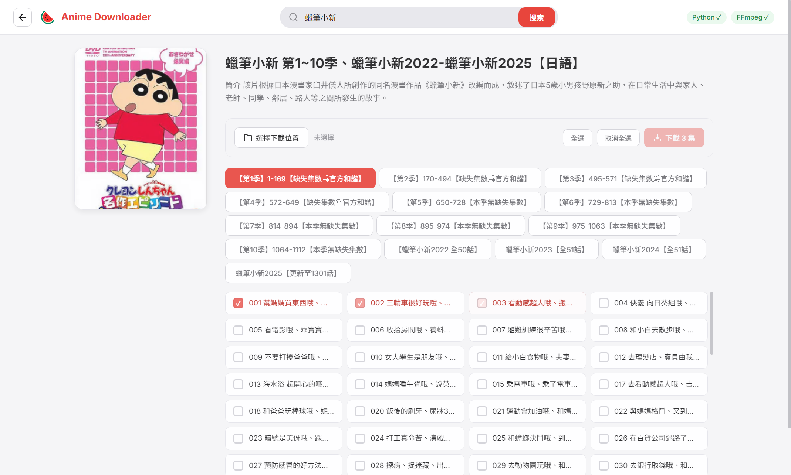
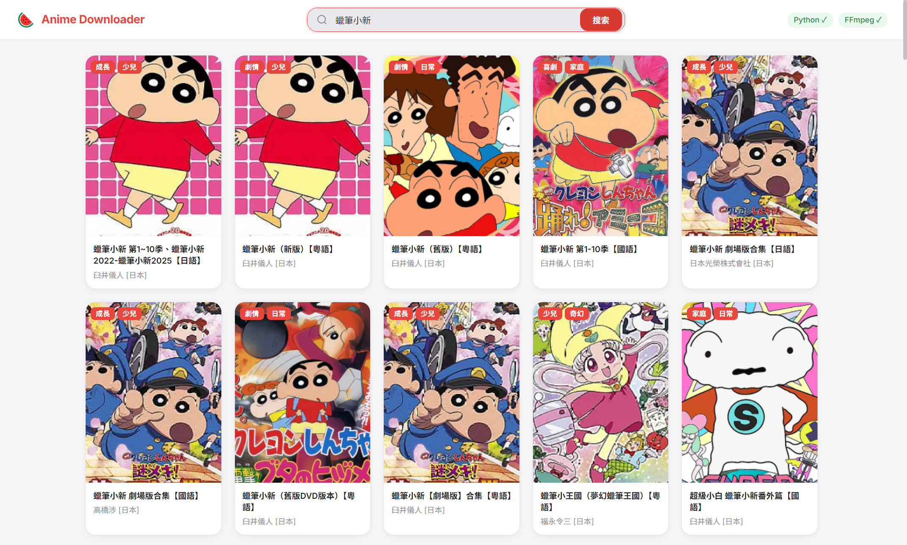
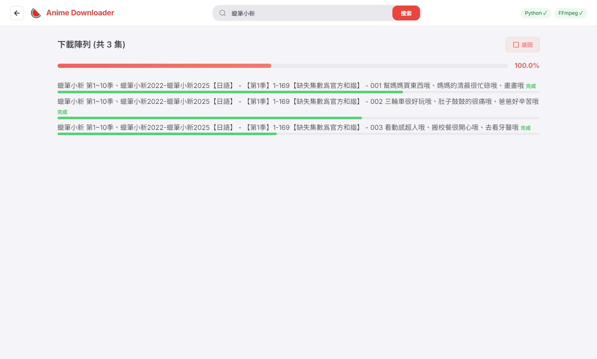

# Anime Downloader

專門給 西瓜卡通 使用的桌面下載器。可以搜尋作品、瀏覽季數與集數、跨季勾選多集，最後交給 Python + FFmpeg 下載影片。

本專案使用 **Electron + TypeScript + Python**，目標是讓 Windows、macOS、Linux 都能用同一套介面完成搜尋、選集、下載與進度追蹤。


## 介面預覽

<p align="center">
  
</p>

<p align="center">
  
  
</p>

短 demo GIF 或影片建議放在 GitHub Release / issue comment，再把連結嵌回 README。這樣展示效果好，也不會讓 repo 因為影片檔變重。

## 功能

- **繁中搜尋**：直接搜尋西瓜卡通上的作品名稱。
- **作品詳情**：顯示封面、簡介、季數、集數列表與更新資訊。
- **跨季選集**：可以在不同季數 tab 之間切換並保留已勾選集數。
- **多集下載**：一次送出多集，下載頁會顯示每集狀態。
- **進度追蹤**：每集獨立顯示完成、失敗、跳過與下載進度。
- **資料夾分層**：輸出路徑依作品名稱與季數整理，避免檔案混在一起。
- **E2E 驗證**：用 Playwright 啟動 Electron，搜尋與詳情打真站，下載階段用 fake progress 驗證 UI。

## 需求

執行 app 需要三類依賴：

- Node.js 18+
- Python 3.7+
- FFmpeg，可在終端機直接執行 `ffmpeg`

Python 下載腳本還需要：

```bash
requests beautifulsoup4
```

## 快速開始

先依照你的作業系統安裝外部依賴，再回到專案根目錄執行：

```bash
npm install
npm run start
```

開發時重跑：

```bash
npm run dev
```

## Windows 安裝

請使用 Windows 原生 PowerShell / CMD / Windows Terminal，不要在 VS Code Remote WSL 裡啟動 Windows 版 app。

用 winget 安裝 Node.js、Python、FFmpeg：

```powershell
winget install -e --id OpenJS.NodeJS.LTS
winget install -e --id Python.Python.3.12
winget install -e --id Gyan.FFmpeg
```

關掉並重新打開 PowerShell，再確認：

```powershell
where node
node --version
where python
python --version
where ffmpeg
ffmpeg -version
```

安裝 Python 套件：

```powershell
python -m pip install requests beautifulsoup4
```

啟動專案：

```powershell
npm install
npm run start
```

如果右上角 `FFmpeg` 顯示紅色叉叉，通常是 FFmpeg 還不在 `PATH`。重新開終端機後再跑一次 `where ffmpeg`。

## macOS 安裝

建議使用 Homebrew 安裝 Node.js、Python、FFmpeg：

```bash
brew install node python ffmpeg
```

確認指令可執行：

```bash
which node
node --version
which python3
python3 --version
which ffmpeg
ffmpeg -version
```

安裝 Python 套件：

```bash
python3 -m pip install requests beautifulsoup4
```

啟動專案：

```bash
npm install
npm run start
```

如果 macOS 跳出安全性或權限提示，這通常是 Electron 開發模式或下載資料夾權限造成的；允許終端機或 Electron 存取你選擇的下載位置即可。

## Linux 安裝

Ubuntu / Debian 可用 apt 安裝基礎依賴：

```bash
sudo apt update
sudo apt install -y nodejs npm python3 python3-pip ffmpeg
```

如果發行版套件庫的 Node.js 太舊，請改用 nvm 或 NodeSource 安裝 Node.js 18+。

確認指令可執行：

```bash
node --version
python3 --version
ffmpeg -version
```

安裝 Python 套件並啟動：

```bash
python3 -m pip install requests beautifulsoup4
npm install
npm run start
```

## 使用方式

1. 在搜尋欄輸入作品名稱，例如 `蠟筆小新`、`海賊王`、`名偵探柯南`。
2. 點選搜尋結果進入作品詳情。
3. 切換季數 tab，勾選要下載的集數。
4. 點選「選擇下載位置」。
5. 點選「開始下載」，到下載頁查看每集進度。

下載資料夾會依「作品名稱 / 季數」建立。

## 開發指令

TypeScript 編譯：

```bash
npm run build
```

啟動 app：

```bash
npm run start
```

執行 E2E：

```bash
npm run test:e2e
```

開有畫面的 E2E：

```bash
npm run test:e2e:headed
```

E2E 測試會真的啟動 Electron app，搜尋與詳情頁會打 `tw.xgcartoon.com`；下載階段使用 fake progress，避免產生大型影片檔。

## 打包狀態

目前專案以原始碼方式啟動，尚未配置正式 `.exe` / `.dmg` 打包流程。

建議後續路線：

- 先加入 `electron-builder`，產出 Windows installer 與 macOS DMG。
- 再決定是否把 FFmpeg 與 Python downloader 一起內嵌，做成真正開箱即用的版本。

在完成自帶依賴前，即使打包成 `.exe` / `.dmg`，使用者仍需要安裝 Python 與 FFmpeg。

## 專案結構

```text
anime-downloader/
├── package.json
├── playwright.config.ts
├── README.md
├── docs/
│   └── assets/
│       ├── detail.png
│       ├── download.png
│       └── search.png
├── renderer/
│   ├── index.html
│   ├── styles.css
│   └── src/
│       ├── app.ts
│       └── types.d.ts
├── scripts/
│   └── download_episodes.py
├── src/
│   ├── main.ts
│   └── preload.ts
└── tests/
    └── e2e/
        └── xgcartoon.spec.ts
```

## 常見問題

**FFmpeg 顯示紅色叉叉**

先在終端機確認：

```bash
ffmpeg -version
```

如果指令不存在，請依上方 Windows / macOS / Linux 安裝段落安裝 FFmpeg。安裝後重新開終端機，再重新啟動 app。

**Python 顯示紅色叉叉**

Windows：

```powershell
python --version
```

macOS / Linux：

```bash
python3 --version
```

如果 Python 已安裝但 app 仍顯示失敗，通常是 PATH 或終端機尚未重新載入環境變數。

**Windows 中文輸入法不能用**

請確認你是在 Windows 原生終端機啟動，而不是 WSL。VS Code 標題列若顯示 `WSL: Ubuntu`，代表目前跑的是 Linux Electron over WSLg，不能拿來判斷原生 Windows 輸入法。

**Windows / WSL 畫面比例怪**

原生 Windows 會依主要螢幕工作區自動縮小初始視窗。WSLg 回報的工作區尺寸有時不準，專案會在偵測到 WSL runtime 時固定使用 `1200x800`。

你也可以手動指定：

```bash
ANIME_DOWNLOADER_WINDOW_SIZE=1200x800 npm run start
```

Windows PowerShell：

```powershell
$env:ANIME_DOWNLOADER_WINDOW_SIZE="1200x800"
npm run start
```

**下載失敗**

依序確認：

- `ffmpeg -version` 可執行。
- `python --version` 或 `python3 --version` 可執行。
- `requests` 與 `beautifulsoup4` 已安裝。
- 下載位置有寫入權限。
- 西瓜卡通該集數仍可在網站播放。

**E2E 突然失敗**

E2E 會打真實西瓜卡通頁面。若網站改版、封鎖、網路不穩或搜尋結果變動，測試可能失敗，通常代表 scraper 或等待條件需要更新。

## 注意事項

本專案僅作為技術交流、學習與研究用途，示範如何以 Electron、TypeScript、Python 與 FFmpeg 串接既有網站頁面與影音串流資訊。專案本身不提供、託管、上傳、儲存、散布或販售任何影片、字幕、圖片或其他受著作權保護的內容，也不是任何影音內容的提供者或代理商。

本工具只會依使用者操作，向使用者可連線的第三方網站發出請求並呼叫本機工具處理資料。使用者應自行確認其使用方式符合所在地法律、網站服務條款，以及內容權利人的授權範圍；請只下載你有權觀看、保存或備份的內容。

本專案不鼓勵、協助或授權任何侵害著作權、規避存取限制、未經授權散布內容或違反第三方服務條款的行為。若你是內容權利人並認為本專案描述或程式碼有不當之處，請提出 issue 以便檢視與處理。

## 授權

MIT
